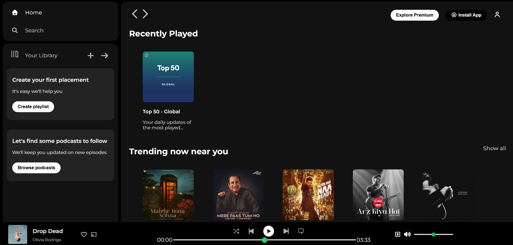

# MiniProject-SpotifyClone
# Spotify Clone

A responsive front-end clone of Spotify built using HTML and CSS. This project recreates Spotify's user interface, including the sidebar, navigation controls, music player, playlists, and responsive layout.

## Features

* Responsive Spotify-inspired UI
* Sidebar navigation menu
* Music player section
* Playlist and album cards
* Interactive hover effects
* Clean and modern design

## Tech Stack

* HTML5
* CSS3
* Font Awesome
* Google Fonts

## What I Learned

* Flexbox and layout design
* CSS positioning and z-index
* Responsive web design
* Styling modern user interfaces
* Working with icons and external fonts

## Preview

## 👨‍💻 Author

Vaishnavi Shetty

